# 📊 Zomato Microservices - Complete Architecture Diagrams

## 🎯 Overview

This document contains all Mermaid diagrams for the Zomato-style microservices architecture. These diagrams provide visual representations of system architecture, request flows, deployment processes, and troubleshooting procedures.

> **💡 Tip**: These diagrams are interactive in GitHub! Hover over elements to see details.

---

## 📋 Table of Contents

1. [Complete System Architecture](#1-complete-system-architecture)
2. [Request Flow Diagram](#2-request-flow-diagram)
3. [Deployment Flow Diagram](#3-deployment-flow-diagram)
4. [Registry Flow Diagram](#4-registry-flow-diagram)
5. [Service Interaction Diagram](#5-service-interaction-diagram)
6. [Auto-Healing Flow Diagram](#6-auto-healing-flow-diagram)
7. [Network Topology Diagram](#7-network-topology-diagram)
8. [Complete Request Lifecycle](#8-complete-request-lifecycle)
9. [Project Structure Diagram](#9-project-structure-diagram)
10. [Component Relationship Diagram](#10-component-relationship-diagram)
11. [Setup Timeline Diagram](#11-setup-timeline-diagram)
12. [Port Mapping Diagram](#12-port-mapping-diagram)
13. [Test Flow Diagram](#13-test-flow-diagram)
14. [Auto-Healing Process Visualization](#14-auto-healing-process-visualization)
15. [Pod Lifecycle Timeline](#15-pod-lifecycle-timeline)
16. [Auto-Healing Scenarios](#16-auto-healing-scenarios)
17. [Troubleshooting Flow Diagram](#17-troubleshooting-flow-diagram)
18. [Registry Naming Convention](#18-registry-naming-convention)
19. [Cleanup Flow Diagram](#19-cleanup-flow-diagram)
20. [Architecture Summary Mind Map](#20-architecture-summary-mind-map)
21. [Technology Stack Diagram](#21-technology-stack-diagram)

---

## 1. Complete System Architecture

This diagram shows the complete architecture of the Zomato microservices system, including all layers from client to infrastructure.

```mermaid
graph TB
    subgraph "Client Layer"
        Browser[🌐 Browser/Client<br/>localhost:8080]
    end
    
    subgraph "Ingress Layer"
        Ingress[🚦 Traefik Ingress Controller<br/>Port: 8080 → 80]
    end
    
    subgraph "Kubernetes Cluster (k3d)"
        subgraph "User Service"
            US1[👤 User Pod 1<br/>Node.js:3001]
            US2[👤 User Pod 2<br/>Node.js:3001]
            US_SVC[📡 User Service<br/>ClusterIP:3001]
        end
        
        subgraph "Restaurant Service"
            RS1[🍽️ Restaurant Pod 1<br/>Python:3002]
            RS2[🍽️ Restaurant Pod 2<br/>Python:3002]
            RS_SVC[📡 Restaurant Service<br/>ClusterIP:3002]
        end
        
        subgraph "Order Service"
            OS1[🛒 Order Pod 1<br/>Go:3003]
            OS2[🛒 Order Pod 2<br/>Go:3003]
            OS_SVC[📡 Order Service<br/>ClusterIP:3003]
        end
    end
    
    subgraph "Infrastructure"
        Registry[📦 k3d Registry<br/>localhost:5000<br/>k3d-zomato-registry:5000]
        K3D[☸️ k3d Cluster<br/>1 Server + 2 Agents]
    end
    
    Browser -->|GET /users| Ingress
    Browser -->|GET /restaurants| Ingress
    Browser -->|GET /orders| Ingress
    
    Ingress -->|Route /users| US_SVC
    Ingress -->|Route /restaurants| RS_SVC
    Ingress -->|Route /orders| OS_SVC
    
    US_SVC -->|Load Balance| US1
    US_SVC -->|Load Balance| US2
    RS_SVC -->|Load Balance| RS1
    RS_SVC -->|Load Balance| RS2
    OS_SVC -->|Load Balance| OS1
    OS_SVC -->|Load Balance| OS2
    
    K3D --> Registry
    
    style Browser fill:#e1f5ff
    style Ingress fill:#fff4e1
    style US1 fill:#e8f5e9
    style US2 fill:#e8f5e9
    style RS1 fill:#fce4ec
    style RS2 fill:#fce4ec
    style OS1 fill:#f3e5f5
    style OS2 fill:#f3e5f5
    style Registry fill:#fff9c4
    style K3D fill:#e0f2f1
```



### 📝 Explanation

- **Client Layer**: Browser accessing the application via `localhost:8080`
- **Ingress Layer**: Traefik Ingress Controller routes requests based on URL paths
- **Kubernetes Cluster**: Contains all microservices with 2 replicas each for high availability
- **Infrastructure**: k3d cluster and local Docker registry for image storage

---

## 2. Request Flow Diagram

This sequence diagram shows how a request flows through the system from browser to pod and back.


### 📝 Explanation

1. Browser sends GET request to Ingress
2. Ingress matches path and routes to appropriate service
3. Service load balances between pod replicas
4. Selected pod processes request and returns response
5. Response flows back through service and ingress to browser

---

## 3. Deployment Flow Diagram

This flowchart shows the complete process of deploying a microservice from code to production.

```mermaid
flowchart TD
    Start([Start: Developer]) --> Code[Write Service Code<br/>Node.js/Python/Go]
    Code --> Dockerfile[Create Dockerfile]
    Dockerfile --> Build[Build Docker Image<br/>docker build]
    Build --> Test{Test Locally?}
    Test -->|Yes| LocalTest[Run Container Locally<br/>docker run]
    LocalTest --> TestResult{Works?}
    TestResult -->|No| Code
    TestResult -->|Yes| Tag[Tag Image for Registry]
    Test -->|No| Tag
    Tag --> Push[Push to Registry<br/>docker push localhost:5000]
    Push --> K8sYAML[Create Kubernetes YAML<br/>Deployment + Service]
    K8sYAML --> Apply[Apply to Cluster<br/>kubectl apply]
    Apply --> K8sPull[Kubernetes Pulls Image<br/>from k3d-zomato-registry:5000]
    K8sPull --> Deploy[Deployment Creates Pods]
    Deploy --> Running{Pods Running?}
    Running -->|No| Debug[Debug: kubectl logs/describe]
    Debug --> Code
    Running -->|Yes| Ingress[Configure Ingress]
    Ingress --> Done([✅ Service Live])
    
    style Start fill:#e1f5ff
    style Done fill:#c8e6c9
    style Test fill:#fff9c4
    style Running fill:#fff9c4
```



### 📝 Explanation

The deployment process includes:
- Code development
- Docker image creation
- Local testing
- Image push to registry
- Kubernetes deployment
- Ingress configuration
- Final verification

---

## 4. Registry Flow Diagram

This diagram illustrates how Docker images flow between host machine, registry, and Kubernetes cluster.

```mermaid
graph LR
    subgraph "Host Machine (RHEL 9)"
        Dev[👨‍💻 Developer]
        DockerHost[Docker Engine]
        Localhost[localhost:5000]
    end
    
    subgraph "k3d Registry Container"
        Registry[k3d-zomato-registry:5000<br/>Docker Registry]
        Storage[(Image Storage)]
    end
    
    subgraph "Kubernetes Cluster"
        K8sNode[Kubernetes Node]
        Pod[Application Pod]
    end
    
    Dev -->|1. docker build| DockerHost
    DockerHost -->|2. docker tag| Localhost
    Localhost -->|3. docker push| Registry
    Registry -->|4. Store| Storage
    
    K8sNode -->|5. Pull Image| Registry
    Registry -->|6. Serve Image| K8sNode
    K8sNode -->|7. Create| Pod
    
    style Dev fill:#e1f5ff
    style Registry fill:#fff9c4
    style Pod fill:#c8e6c9
    style Storage fill:#f3e5f5
```



### 📝 Explanation

**Push Flow (Host → Registry)**:
1. Developer builds image
2. Image tagged for registry
3. Image pushed to registry
4. Registry stores image

**Pull Flow (Registry → Kubernetes)**:
5. Kubernetes node pulls image
6. Registry serves image
7. Pod created with image

---

## 5. Service Interaction Diagram

This diagram shows how services interact with each other and how load balancing works.

```mermaid
graph TB
    subgraph "External Access"
        Client[Client/Browser]
    end
    
    subgraph "Ingress Layer"
        Traefik[Traefik Ingress<br/>Port 8080]
    end
    
    subgraph "Service Layer"
        US[User Service<br/>ClusterIP:3001]
        RS[Restaurant Service<br/>ClusterIP:3002]
        OS[Order Service<br/>ClusterIP:3003]
    end
    
    subgraph "Pod Layer - User Service"
        UP1[User Pod 1<br/>Replica 1]
        UP2[User Pod 2<br/>Replica 2]
    end
    
    subgraph "Pod Layer - Restaurant Service"
        RP1[Restaurant Pod 1<br/>Replica 1]
        RP2[Restaurant Pod 2<br/>Replica 2]
    end
    
    subgraph "Pod Layer - Order Service"
        OP1[Order Pod 1<br/>Replica 1]
        OP2[Order Pod 2<br/>Replica 2]
    end
    
    Client -->|HTTP Request| Traefik
    Traefik -->|/users →| US
    Traefik -->|/restaurants →| RS
    Traefik -->|/orders →| OS
    
    US -.->|Load Balance| UP1
    US -.->|Load Balance| UP2
    RS -.->|Load Balance| RP1
    RS -.->|Load Balance| RP2
    OS -.->|Load Balance| OP1
    OS -.->|Load Balance| OP2
    
    style Client fill:#e1f5ff
    style Traefik fill:#fff4e1
    style US fill:#e8f5e9
    style RS fill:#fce4ec
    style OS fill:#f3e5f5
```



### 📝 Explanation

- **External Access**: Client makes HTTP requests
- **Ingress Layer**: Routes requests based on paths
- **Service Layer**: Kubernetes Services provide load balancing
- **Pod Layer**: Multiple replicas handle requests

---

## 6. Auto-Healing Flow Diagram

This sequence diagram shows how Kubernetes automatically recovers from pod failures.


### 📝 Explanation

1. Pod fails or is deleted
2. Kubernetes controller detects mismatch
3. New pod is created automatically
4. Image pulled and container started
5. Health check passes
6. Service updated with new pod
7. Traffic routed to new pod

---

## 7. Network Topology Diagram

This diagram shows the physical and logical network structure of the k3d cluster.


### 📝 Explanation

- **Control Plane**: Kubernetes master node
- **Worker Nodes**: Two agent nodes for running pods
- **System Pods**: Core Kubernetes components
- **Application Pods**: User services
- **Registry**: Local Docker registry for images

---

## 8. Complete Request Lifecycle

This flowchart shows all states a request goes through from initiation to completion.


### 📝 Explanation

Request goes through these steps:
1. **Client Request**: User opens browser
2. **Ingress Routing**: GET request to localhost:8080/users
3. **Path Matching**: Traefik receives and matches path
4. **Service Discovery**: Match /users path to user-service
5. **Load Balancing**: Route to user-service:3001
6. **Pod Selection**: Select pod using Round Robin
7. **Pod Processing**: Forward to selected pod
8. **Data Retrieval**: Process request
9. **Response Generation**: Generate JSON response
10. **Response Delivery**: Return to browser and display

---

## 9. Project Structure Diagram

This diagram shows the file and directory structure of the project.


### 📝 Explanation

- **Root**: Main project directory
- **Service Directories**: Each microservice has its own directory
- **k8s Directory**: Contains all Kubernetes manifests

---

## 10. Component Relationship Diagram

This ER diagram shows the relationships between Kubernetes objects.


### 📝 Explanation

Shows relationships:
- Ingress routes to Services
- Services manage Pods
- Deployments create Pods
- Pods contain Containers
- Containers use Images
- Images stored in Registry
- Nodes host Pods
- Cluster contains Nodes

---

## 11. Setup Timeline Diagram

This Gantt chart shows the timeline for setting up the entire system.


### 📝 Explanation

Total setup time: ~60 minutes
- Infrastructure: 15 minutes
- Services: 30 minutes
- Kubernetes: 10 minutes
- Verification: 5 minutes

---

## 12. Port Mapping Diagram

This diagram shows how ports are mapped from external access to internal services.


### 📝 Explanation

- External: Port 8080
- Ingress: Port 80 internally
- Services: Ports 3001, 3002, 3003
- Pods: Same ports as services

---

## 13. Test Flow Diagram

This sequence diagram shows the testing process for verifying services.


### 📝 Explanation

Testing flow:
1. Tester opens browser
2. Request sent to Ingress
3. Ingress routes to service
4. Service forwards to pod
5. Pod processes and responds
6. Response displayed in browser

---

## 14. Auto-Healing Process Visualization

This flowchart shows the complete auto-healing process.


### 📝 Explanation

Auto-healing process:
1. **Normal Operation**: System running normally
2. **Pod Failure**: Pod crashes, deleted, or node fails
3. **Controller Detection**: Kubernetes detects replica mismatch
4. **Check Desired State**: Compare current vs desired replica count
5. **Create Pod**: Create new pod if needed
6. **Pull Image**: Pull container image from registry
7. **Start Container**: Start the container
8. **Health Check**: Verify pod is healthy
9. **Pod Ready**: Pod becomes ready and serves traffic
10. **System Restored**: Normal operation resumed

---

## 15. Pod Lifecycle Timeline

This Gantt chart shows the timeline for pod auto-healing.


### 📝 Explanation

Total recovery time: ~43 seconds
- Detection: 2 seconds
- Image pull: 5 seconds
- Container start: 3 seconds
- Health check: 2 seconds

---

## 16. Auto-Healing Scenarios

This diagram shows different scenarios that trigger auto-healing.


### 📝 Explanation

Four common failure scenarios:
1. Manual deletion
2. Application crash
3. Node failure
4. Resource exhaustion

All lead to automatic pod recreation.

---

## 17. Troubleshooting Flow Diagram

This flowchart shows the troubleshooting process for common issues.


### 📝 Explanation

Troubleshooting steps:
1. Identify issue type
2. Check relevant component
3. Apply fix
4. Test solution
5. Verify resolution

---

## 18. Registry Naming Convention

This diagram explains why we use different registry names from host vs Kubernetes.


### 📝 Explanation

**Key Points:**
- `localhost:5000` - Used by Docker on host machine
- `k3d-zomato-registry:5000` - Used by Kubernetes pods (internal DNS)
- Both resolve to the same Docker container
- Images stored once, accessible from both contexts

---

## 19. Cleanup Flow Diagram

This flowchart shows the complete cleanup process.

```mermaid
flowchart TD
    Start([Start Cleanup]) --> Step1[1. Delete k3d Clusters<br/>k3d cluster delete --all]
    Step1 --> Step2[2. Delete k3d Registries<br/>k3d registry delete --all]
    Step2 --> Step3[3. Stop All Containers<br/>docker rm -f $ docker ps -aq]
    Step3 --> Step4[4. Remove All Images<br/>docker rmi -f $ docker images -aq]
    Step4 --> Step5[5. Remove Volumes<br/>docker volume prune -f]
    Step5 --> Step6[6. Remove Networks<br/>docker network prune -f]
    Step6 --> Step7[7. Deep Cleanup<br/>docker system prune -a -f --volumes]
    Step7 --> Verify[8. Verify Cleanup<br/>Check all resources]
    Verify --> Clean{Everything Clean?}
    Clean -->|Yes| Done([✅ Cleanup Complete])
    Clean -->|No| Step1
    
    style Start fill:#e1f5ff
    style Done fill:#c8e6c9
    style Clean fill:#fff9c4
```



### 📝 Explanation

Cleanup steps:
1. Delete k3d clusters
2. Delete k3d registries
3. Stop all containers
4. Remove all images
5. Remove volumes
6. Remove networks
7. Deep cleanup
8. Verify cleanup

---

## 20. Architecture Summary Mind Map

This mind map provides a high-level overview of the entire architecture.


### 📝 Explanation

Main categories:
- Infrastructure: Docker, k3d, Registry
- Services: Three microservices
- Kubernetes: Deployments, Services, Ingress
- Features: Auto-healing, Load balancing, etc.

---

## 21. Technology Stack Diagram

This diagram shows the technology stack from application to infrastructure.

```mermaid
graph TB
    subgraph "Application Layer"
        NodeJS[Node.js 18<br/>Express]
        Python[Python 3.11<br/>Flask]
        Go[Go 1.21<br/>net/http]
    end
    
    subgraph "Container Layer"
        Docker[Docker<br/>Containerization]
    end
    
    subgraph "Orchestration Layer"
        K8s[Kubernetes<br/>k3d]
        K8sDeploy[Deployments]
        K8sSvc[Services]
        K8sIngress[Ingress]
    end
    
    subgraph "Infrastructure Layer"
        Registry[Docker Registry<br/>k3d Registry]
        Network[Docker Network<br/>k3d Network]
    end
    
    NodeJS --> Docker
    Python --> Docker
    Go --> Docker
    Docker --> Registry
    Registry --> K8s
    K8s --> K8sDeploy
    K8s --> K8sSvc
    K8s --> K8sIngress
    K8s --> Network
    
    style NodeJS fill:#e8f5e9
    style Python fill:#fce4ec
    style Go fill:#f3e5f5
    style Docker fill:#e1f5ff
    style K8s fill:#fff9c4
```

### 📝 Explanation

Technology layers:
1. **Application Layer**: Node.js, Python, Go
2. **Container Layer**: Docker
3. **Orchestration Layer**: Kubernetes (k3d)
4. **Infrastructure Layer**: Registry, Network

---

## 📚 How to Use These Diagrams

1. **For Learning**: Study each diagram to understand system components
2. **For Troubleshooting**: Use troubleshooting flow diagram
3. **For Deployment**: Follow deployment flow diagram
4. **For Architecture**: Refer to system architecture diagrams

---

## 🔗 Related Documentation

- [README.md](./README.md) - Complete setup guide and instructions
- [GitHub Repository](https://github.com/auspicious27/devops_masterclass-readmee) - Source code and documentation

---

**🎉 Happy Learning! 🚀**

