# 🍽️ Zomato-Style Microservices Architecture

## 🚀 Complete Setup Guide: Docker + k3d + Kubernetes + Ingress

**Validated on RHEL 9** ✅

---

## 📋 Table of Contents

1. [Overview](#overview)
2. [Prerequisites](#prerequisites)
3. [Step 0: Pre-Check](#step-0-pre-check-important)
4. [Step 1: Install Docker](#step-1-install-docker-rhel-9--valid-way)
5. [Step 2: Install kubectl](#step-2-install-kubectl)
6. [Step 3: Install k3d](#step-3-install-k3d)
7. [Step 4: Create Local Registry](#step-4-create-local-registry-mandatory)
8. [Step 5: Create Kubernetes Cluster](#step-5-create-kubernetes-cluster-valid-flags)
9. [Step 6: Install Ingress Controller](#step-6-install-ingress-controller-required)
10. [Step 7: Project Structure](#step-7-project-structure)
11. [Step 8: User Service (Node.js)](#step-8-user-service-nodejs--fixed-path)
12. [Step 9: Restaurant Service (Python)](#step-9-restaurant-service-python)
13. [Step 10: Order Service (Go)](#step-10-order-service-go)
14. [Step 11: Kubernetes Deployment Files](#step-11-kubernetes-deployment-files)
15. [Step 12: Ingress Configuration](#step-12-ingress-final--working)
16. [Step 13: Final Testing](#step-13-final-test-this-will-work)
17. [Step 14: Auto-Healing Demo](#step-14-auto-healing-demo-wow-moment)
18. [Troubleshooting](#troubleshooting)
19. [Cleanup](#cleanup-full-cleanup-containers--registry--k3d-cluster)

---

## 🎯 Overview

This guide will help you build a complete microservices architecture similar to Zomato, with:

- ✅ **3 Microservices**: User, Restaurant, and Order services
- ✅ **Kubernetes Orchestration**: Auto-healing, load balancing, and scaling
- ✅ **Ingress Routing**: Single entry point for all services
- ✅ **Local Registry**: Private Docker registry for container images
- ✅ **Load Balancing**: Multiple replicas for high availability

### 🧠 What You Will Achieve (Guaranteed)

- `/users`, `/restaurants`, `/orders` working on browser
- Kubernetes pods auto-heal
- Load balancing with replicas
- Ingress routing works
- Runs fully on RHEL 9

---

## 📊 System Architecture Diagrams

### 🏗️ Complete System Architecture

```mermaid
graph TB
    subgraph "Client Layer"
        Browser[🌐 Browser/Client<br/>localhost:8080]
    end
    
    subgraph "Ingress Layer"
        Ingress[🚦 Traefik Ingress Controller<br/>Port: 8080 → 80]
    end
    
    subgraph "Kubernetes Cluster (k3d)"
        subgraph "User Service"
            US1[👤 User Pod 1<br/>Node.js:3001]
            US2[👤 User Pod 2<br/>Node.js:3001]
            US_SVC[📡 User Service<br/>ClusterIP:3001]
        end
        
        subgraph "Restaurant Service"
            RS1[🍽️ Restaurant Pod 1<br/>Python:3002]
            RS2[🍽️ Restaurant Pod 2<br/>Python:3002]
            RS_SVC[📡 Restaurant Service<br/>ClusterIP:3002]
        end
        
        subgraph "Order Service"
            OS1[🛒 Order Pod 1<br/>Go:3003]
            OS2[🛒 Order Pod 2<br/>Go:3003]
            OS_SVC[📡 Order Service<br/>ClusterIP:3003]
        end
    end
    
    subgraph "Infrastructure"
        Registry[📦 k3d Registry<br/>localhost:5000<br/>k3d-zomato-registry:5000]
        K3D[☸️ k3d Cluster<br/>1 Server + 2 Agents]
    end
    
    Browser -->|GET /users| Ingress
    Browser -->|GET /restaurants| Ingress
    Browser -->|GET /orders| Ingress
    
    Ingress -->|Route /users| US_SVC
    Ingress -->|Route /restaurants| RS_SVC
    Ingress -->|Route /orders| OS_SVC
    
    US_SVC -->|Load Balance| US1
    US_SVC -->|Load Balance| US2
    RS_SVC -->|Load Balance| RS1
    RS_SVC -->|Load Balance| RS2
    OS_SVC -->|Load Balance| OS1
    OS_SVC -->|Load Balance| OS2
    
    K3D --> Registry
    
    style Browser fill:#e1f5ff
    style Ingress fill:#fff4e1
    style US1 fill:#e8f5e9
    style US2 fill:#e8f5e9
    style RS1 fill:#fce4ec
    style RS2 fill:#fce4ec
    style OS1 fill:#f3e5f5
    style OS2 fill:#f3e5f5
    style Registry fill:#fff9c4
    style K3D fill:#e0f2f1
```

### 🔄 Request Flow Diagram

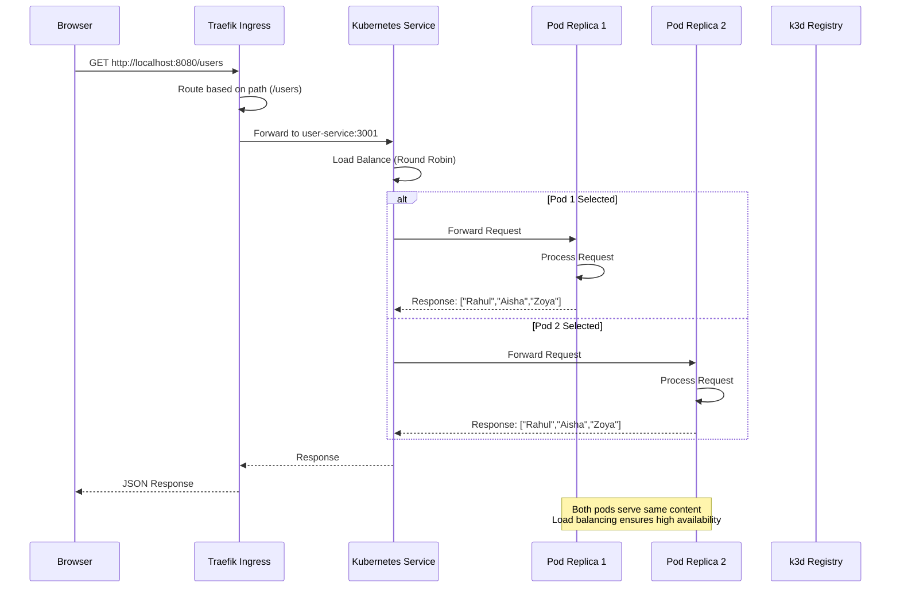

### 🚀 Deployment Flow Diagram

```mermaid
flowchart TD
    Start([Start: Developer]) --> Code[Write Service Code<br/>Node.js/Python/Go]
    Code --> Dockerfile[Create Dockerfile]
    Dockerfile --> Build[Build Docker Image<br/>docker build]
    Build --> Test{Test Locally?}
    Test -->|Yes| LocalTest[Run Container Locally<br/>docker run]
    LocalTest --> TestResult{Works?}
    TestResult -->|No| Code
    TestResult -->|Yes| Tag[Tag Image for Registry]
    Test -->|No| Tag
    Tag --> Push[Push to Registry<br/>docker push localhost:5000]
    Push --> K8sYAML[Create Kubernetes YAML<br/>Deployment + Service]
    K8sYAML --> Apply[Apply to Cluster<br/>kubectl apply]
    Apply --> K8sPull[Kubernetes Pulls Image<br/>from k3d-zomato-registry:5000]
    K8sPull --> Deploy[Deployment Creates Pods]
    Deploy --> Running{Pods Running?}
    Running -->|No| Debug[Debug: kubectl logs/describe]
    Debug --> Code
    Running -->|Yes| Ingress[Configure Ingress]
    Ingress --> Done([✅ Service Live])
    
    style Start fill:#e1f5ff
    style Done fill:#c8e6c9
    style Test fill:#fff9c4
    style Running fill:#fff9c4
```

### 📦 Registry Flow Diagram

```mermaid
graph LR
    subgraph "Host Machine (RHEL 9)"
        Dev[👨‍💻 Developer]
        DockerHost[Docker Engine]
        Localhost[localhost:5000]
    end
    
    subgraph "k3d Registry Container"
        Registry[k3d-zomato-registry:5000<br/>Docker Registry]
        Storage[(Image Storage)]
    end
    
    subgraph "Kubernetes Cluster"
        K8sNode[Kubernetes Node]
        Pod[Application Pod]
    end
    
    Dev -->|1. docker build| DockerHost
    DockerHost -->|2. docker tag| Localhost
    Localhost -->|3. docker push| Registry
    Registry -->|4. Store| Storage
    
    K8sNode -->|5. Pull Image| Registry
    Registry -->|6. Serve Image| K8sNode
    K8sNode -->|7. Create| Pod
    
    style Dev fill:#e1f5ff
    style Registry fill:#fff9c4
    style Pod fill:#c8e6c9
    style Storage fill:#f3e5f5
```

### 🔗 Service Interaction Diagram

```mermaid
graph TB
    subgraph "External Access"
        Client[Client/Browser]
    end
    
    subgraph "Ingress Layer"
        Traefik[Traefik Ingress<br/>Port 8080]
    end
    
    subgraph "Service Layer"
        US[User Service<br/>ClusterIP:3001]
        RS[Restaurant Service<br/>ClusterIP:3002]
        OS[Order Service<br/>ClusterIP:3003]
    end
    
    subgraph "Pod Layer - User Service"
        UP1[User Pod 1<br/>Replica 1]
        UP2[User Pod 2<br/>Replica 2]
    end
    
    subgraph "Pod Layer - Restaurant Service"
        RP1[Restaurant Pod 1<br/>Replica 1]
        RP2[Restaurant Pod 2<br/>Replica 2]
    end
    
    subgraph "Pod Layer - Order Service"
        OP1[Order Pod 1<br/>Replica 1]
        OP2[Order Pod 2<br/>Replica 2]
    end
    
    Client -->|HTTP Request| Traefik
    Traefik -->|/users →| US
    Traefik -->|/restaurants →| RS
    Traefik -->|/orders →| OS
    
    US -.->|Load Balance| UP1
    US -.->|Load Balance| UP2
    RS -.->|Load Balance| RP1
    RS -.->|Load Balance| RP2
    OS -.->|Load Balance| OP1
    OS -.->|Load Balance| OP2
    
    style Client fill:#e1f5ff
    style Traefik fill:#fff4e1
    style US fill:#e8f5e9
    style RS fill:#fce4ec
    style OS fill:#f3e5f5
```

### 💥 Auto-Healing Flow Diagram

```mermaid
sequenceDiagram
    participant K8s as Kubernetes Controller
    participant Pod as Pod (Running)
    participant NewPod as New Pod
    participant Service as Service
    
    Note over Pod: Pod Running Normally<br/>Serving Traffic
    
    K8s->>Pod: Delete Pod (Manual/Accident)
    Pod->>Pod: Pod Terminated
    
    K8s->>K8s: Detect Pod Count < Replicas (2)
    K8s->>K8s: Desired State: 2 Pods
    
    K8s->>NewPod: Create New Pod
    NewPod->>NewPod: Pull Image from Registry
    NewPod->>NewPod: Container Starting
    NewPod->>NewPod: Health Check Pass
    NewPod->>NewPod: Pod Ready
    
    K8s->>Service: Update Endpoints
    Service->>Service: Add New Pod to Load Balancer
    
    Note over K8s,Service: ✅ Auto-Healing Complete<br/>Service Uninterrupted
    
    Service->>NewPod: Route Traffic
```

### 🌐 Network Topology Diagram

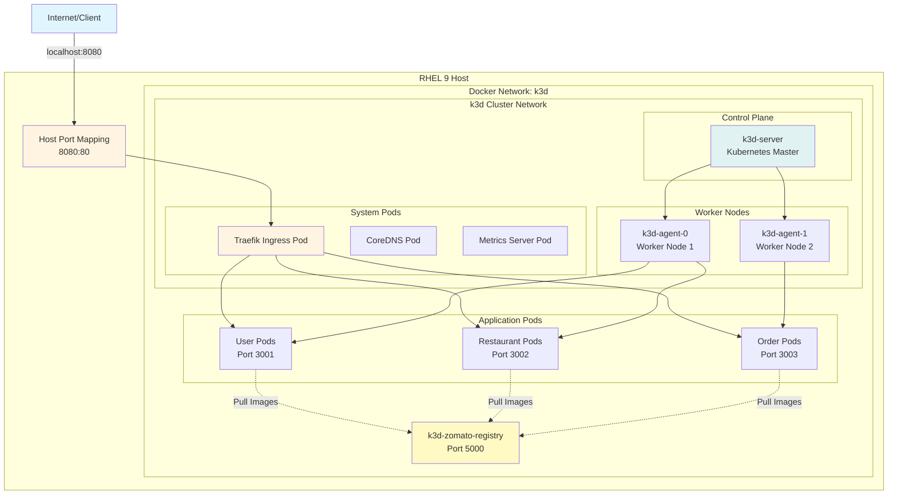

### 🔄 Complete Request Lifecycle

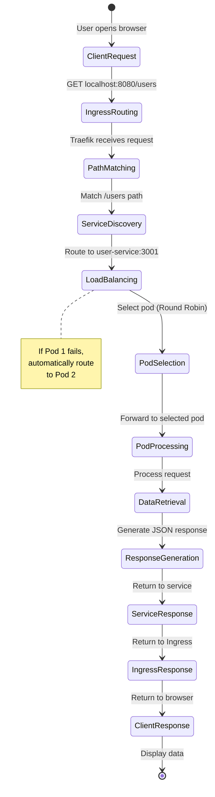

### 📁 Project Structure Diagram

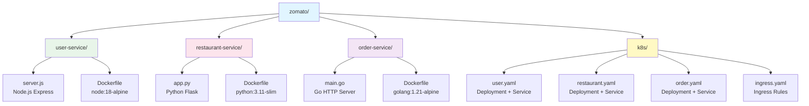

### 🎯 Component Relationship Diagram

```mermaid
erDiagram
    INGRESS ||--o{ SERVICE : routes
    SERVICE ||--|{ POD : manages
    DEPLOYMENT ||--|{ POD : creates
    POD ||--|| CONTAINER : contains
    CONTAINER ||--|| IMAGE : uses
    IMAGE ||--|| REGISTRY : stored_in
    NODE ||--o{ POD : hosts
    CLUSTER ||--|{ NODE : contains
    
    INGRESS {
        string name "zomato-ingress"
        int port 8080
        string controller "Traefik"
    }
    
    SERVICE {
        string name "user-service"
        int port 3001
        string type "ClusterIP"
    }
    
    POD {
        string name "user-pod"
        string status "Running"
        int replicas 2
    }
    
    DEPLOYMENT {
        string name "user-service"
        int replicas 2
        string strategy "RollingUpdate"
    }
    
    CONTAINER {
        string image "user-service:v1"
        int port 3001
    }
    
    IMAGE {
        string name "user-service"
        string tag "v1"
        string registry "k3d-zomato-registry:5000"
    }
    
    REGISTRY {
        string name "k3d-zomato-registry"
        int port 5000
    }
    
    NODE {
        string name "k3d-agent-0"
        string role "worker"
    }
    
    CLUSTER {
        string name "zomato-cluster"
        int servers 1
        int agents 2
    }
```

### 📖 How to Read the Diagrams

The Mermaid diagrams above illustrate different aspects of the system:

1. **Complete System Architecture**: Shows all components and their relationships
2. **Request Flow**: Sequence diagram showing how a request travels through the system
3. **Deployment Flow**: Step-by-step process of deploying a service
4. **Registry Flow**: How images are stored and retrieved
5. **Service Interaction**: How services communicate with each other
6. **Auto-Healing Flow**: How Kubernetes recovers from failures
7. **Network Topology**: Physical and logical network structure
8. **Request Lifecycle**: State machine of a request
9. **Project Structure**: File organization
10. **Component Relationship**: Entity-relationship diagram of Kubernetes objects

> **💡 Tip**: These diagrams are interactive in GitHub! Hover over elements to see details.

---

## 🔒 Prerequisites

- **OS**: Red Hat Enterprise Linux 9.x
- **Sudo Access**: Required for system-level installations
- **Internet Connection**: For downloading packages and images
- **Basic Knowledge**: Docker, Kubernetes concepts (helpful but not required)

---

## 🔒 STEP 0: PRE-CHECK (IMPORTANT)

### Verify RHEL 9

```bash
cat /etc/redhat-release
```

**Expected Output:**
```
Red Hat Enterprise Linux release 9.x
```

### Disable SELinux for Demo Stability

```bash
sudo setenforce 0
getenforce
```

**Expected Output:**
```
Permissive
```

> **Note**: This is for demo purposes. In production, configure SELinux properly.

---

## 🐳 STEP 1: Install Docker (RHEL 9 – VALID WAY)

### Remove Podman (if installed)

```bash
sudo dnf remove -y podman podman-docker
```

### Add Docker Repository

```bash
sudo dnf config-manager --add-repo \
  https://download.docker.com/linux/centos/docker-ce.repo
```

### Install Docker

```bash
sudo dnf install -y docker-ce docker-ce-cli containerd.io
```

### Start Docker Service

```bash
sudo systemctl enable docker --now
```

### Add User to Docker Group

```bash
sudo usermod -aG docker $USER
newgrp docker
```

### Test Docker Installation

```bash
docker run hello-world
```

**✅ If this runs → Docker OK**

---

## ☸️ STEP 2: Install kubectl

### Download kubectl

```bash
curl -LO https://dl.k8s.io/release/$(curl -L -s \
  https://dl.k8s.io/release/stable.txt)/bin/linux/amd64/kubectl
```

### Make Executable and Install

```bash
chmod +x kubectl
sudo mv kubectl /usr/local/bin/
```

### Verify Installation

```bash
kubectl version --client
```

---

## 🏗️ STEP 3: Install k3d

### Install k3d

```bash
curl -s https://raw.githubusercontent.com/k3d-io/k3d/main/install.sh | bash
```

### Verify Installation

```bash
k3d version
```

---

## 📦 STEP 4: Create Local Registry (MANDATORY)

### Create Registry

```bash
k3d registry create zomato-registry --port 5000
```

### Verify Registry

```bash
docker ps | grep registry
curl http://localhost:5000/v2/_catalog
```

**Expected Output:**
```json
{"repositories":[]}
```

---

## 🏙️ STEP 5: Create Kubernetes Cluster (VALID FLAGS)

### Create k3d Cluster

```bash
k3d cluster create zomato-cluster \
  --agents 2 \
  -p "8080:80@loadbalancer" \
  --registry-use k3d-zomato-registry:5000
```

### Verify Cluster

```bash
kubectl get nodes
```

**Expected Output:**
```
1 server + 2 agents → Ready
```

---

## 🚦 STEP 6: Install Ingress Controller (REQUIRED)

### Install Traefik Ingress

```bash
kubectl apply -f https://raw.githubusercontent.com/k3d-io/k3d/main/docs/usage/guides/traefik.yaml
```

### Verify Ingress Controller

```bash
kubectl get pods -n kube-system | grep traefik
```

**Expected Output:**
```
traefik-xxxx                     1/1 Running
```

### Verify All System Pods

```bash
kubectl get pods -n kube-system
```

**You MUST see:**
- `coredns-xxxx` → 1/1 Running
- `helm-install-traefik-xxxx` → Completed
- `helm-install-traefik-crd-xxxx` → Completed
- `local-path-provisioner-xxxx` → 1/1 Running
- `metrics-server-xxxx` → 1/1 Running
- `traefik-xxxx` → 1/1 Running

> ⏱️ This can take 2–4 minutes on RHEL 9

---

## 📁 STEP 7: Project Structure

### 📅 Setup Timeline

```mermaid
gantt
    title Zomato Microservices Setup Timeline
    dateFormat X
    axisFormat %s
    
    section Infrastructure
    Install Docker           :0, 5m
    Install kubectl          :5m, 2m
    Install k3d             :7m, 2m
    Create Registry         :9m, 1m
    Create Cluster          :10m, 3m
    Install Ingress         :13m, 2m
    
    section Services
    User Service            :15m, 10m
    Restaurant Service      :25m, 10m
    Order Service           :35m, 10m
    
    section Kubernetes
    Deploy Services         :45m, 5m
    Configure Ingress       :50m, 2m
    Testing                 :52m, 3m
    
    section Verification
    Final Testing           :55m, 5m
```

### Create Project Directory

```bash
mkdir zomato && cd zomato
```

### 📂 Project Structure Visualization

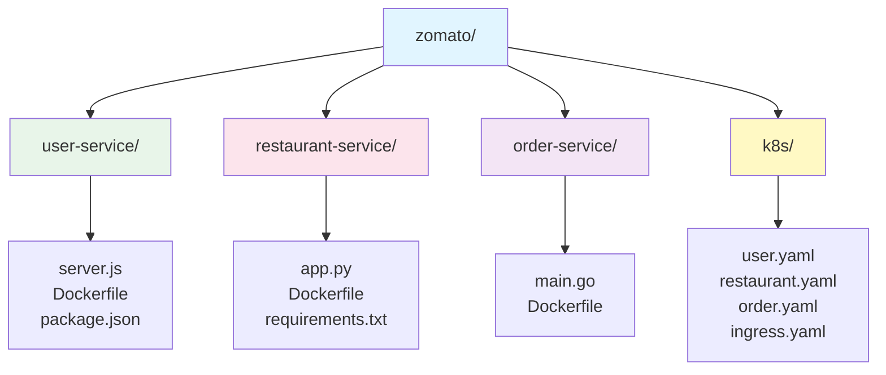

---

## 👤 STEP 8: USER SERVICE (Node.js – FIXED PATH)

### Create User Service Directory

```bash
mkdir user-service && cd user-service
```

### Create `server.js`

```javascript
const express = require('express');
const app = express();

app.get('/', (req, res) => {
  res.json(["Rahul", "Aisha", "Zoya"]);
});

app.get('/health', (req, res) => {
  res.send("OK");
});

app.listen(3001, () => {
  console.log("User service running");
});
```

### Create `Dockerfile`

```dockerfile
FROM node:18-alpine
WORKDIR /app
RUN npm init -y && npm install express
COPY server.js .
EXPOSE 3001
CMD ["node", "server.js"]
```

### Test User Service Locally (Docker Only)

#### Build Test Image

```bash
docker build -t user-test:v1 .
```

#### Run Test Container

```bash
docker run -d \
  --name user-test \
  -p 3001:3001 \
  user-test:v1
```

#### Check Logs

```bash
docker logs user-test
```

**Expected Output:**
```
User service running
```

#### Test Service

```bash
curl http://localhost:3001
```

**Expected Output:**
```json
["Rahul","Aisha","Zoya"]
```

#### Health Check

```bash
curl http://localhost:3001/health
```

**Expected Output:**
```
OK
```

#### Cleanup Test Container

```bash
docker stop user-test
docker rm user-test
```

### Build & Push to Registry

```bash
docker build -t k3d-zomato-registry:5000/user-service:v1 .
docker tag k3d-zomato-registry:5000/user-service:v1 localhost:5000/user-service:v1
docker push localhost:5000/user-service:v1
```

### Verify Registry

```bash
curl http://localhost:5000/v2/user-service/tags/list
```

**Expected Output:**
```json
{"name":"user-service","tags":["v1"]}
```

### Return to Project Root

```bash
cd ..
```

---

## 🍽️ STEP 9: RESTAURANT SERVICE (Python)

### Create Restaurant Service Directory

```bash
mkdir restaurant-service && cd restaurant-service
```

### Create `app.py`

```python
from flask import Flask, jsonify
app = Flask(__name__)

@app.route('/restaurants')
def restaurants():
    return jsonify(["Pizza Hub", "Biryani House"])

@app.route('/health')
def health():
    return "OK"

app.run(host='0.0.0.0', port=3002)
```

### Create `Dockerfile`

```dockerfile
FROM python:3.11-slim
WORKDIR /app
RUN pip install flask
COPY app.py .
EXPOSE 3002
CMD ["python", "app.py"]
```

### Test Restaurant Service Locally (Docker Only)

#### Build Test Image

```bash
docker build -t restaurant-test:v1 .
```

#### Run Test Container

```bash
docker run -d \
  --name restaurant-test \
  -p 3002:3002 \
  restaurant-test:v1
```

#### Check Logs

```bash
docker logs restaurant-test
```

**Expected Output:**
```
Running on http://0.0.0.0:3002
```

#### Test Service

```bash
curl http://localhost:3002/restaurants
```

**Expected Output:**
```json
["Pizza Hub","Biryani House"]
```

#### Health Check

```bash
curl http://localhost:3002/health
```

**Expected Output:**
```
OK
```

#### Cleanup Test Container

```bash
docker stop restaurant-test
docker rm restaurant-test
```

### Build & Push to Registry

```bash
docker build -t k3d-zomato-registry:5000/restaurant-service:v1 .
docker tag k3d-zomato-registry:5000/restaurant-service:v1 localhost:5000/restaurant-service:v1
docker push localhost:5000/restaurant-service:v1
```

### Verify Registry

```bash
curl http://localhost:5000/v2/restaurant-service/tags/list
```

**Expected Output:**
```json
{"name":"restaurant-service","tags":["v1"]}
```

### Return to Project Root

```bash
cd ..
```

---

## 🛒 STEP 10: ORDER SERVICE (Go)

### Create Order Service Directory

```bash
mkdir order-service && cd order-service
```

### Create `main.go`

```go
package main
import "net/http"

func main() {
	http.HandleFunc("/", func(w http.ResponseWriter, r *http.Request) {
		w.Write([]byte("Order Placed Successfully"))
	})
	http.ListenAndServe(":3003", nil)
}
```

### Create `Dockerfile`

```dockerfile
FROM golang:1.21-alpine

WORKDIR /app

ENV GO111MODULE=off

COPY main.go .

RUN go build -o main main.go

EXPOSE 3003

CMD ["./main"]
```

### Test Order Service Locally (Docker Only)

#### Build Test Image

```bash
docker build -t order-service:test .
```

#### Run Test Container

```bash
docker run -d --name order-test -p 3003:3003 order-service:test
```

#### Test Service

```bash
curl http://localhost:3003
```

**Expected Output:**
```
Order Placed Successfully
```

#### Cleanup Test Container

```bash
docker stop order-test
docker rm order-test
```

### Build & Push to Registry

```bash
docker tag order-service:test k3d-zomato-registry:5000/order-service:v1
docker tag k3d-zomato-registry:5000/order-service:v1 localhost:5000/order-service:v1
docker push localhost:5000/order-service:v1
```

### Verify Registry

```bash
curl http://localhost:5000/v2/_catalog
```

**Must include:**
- `user-service`
- `restaurant-service`
- `order-service`

### Return to Project Root

```bash
cd ..
```

---

## ☸️ STEP 11: Kubernetes Deployment Files

### Create k8s Directory

```bash
mkdir k8s
```

### Create `k8s/user.yaml`

```yaml
apiVersion: apps/v1
kind: Deployment
metadata:
  name: user-service
spec:
  replicas: 2
  selector:
    matchLabels:
      app: user
  template:
    metadata:
      labels:
        app: user
    spec:
      containers:
      - name: user
        image: k3d-zomato-registry:5000/user-service:v1
        ports:
        - containerPort: 3001
---
apiVersion: v1
kind: Service
metadata:
  name: user-service
spec:
  selector:
    app: user
  ports:
  - port: 3001
    targetPort: 3001
```

### Create `k8s/restaurant.yaml`

```yaml
apiVersion: apps/v1
kind: Deployment
metadata:
  name: restaurant-service
spec:
  replicas: 2
  selector:
    matchLabels:
      app: restaurant
  template:
    metadata:
      labels:
        app: restaurant
    spec:
      containers:
      - name: restaurant
        image: k3d-zomato-registry:5000/restaurant-service:v1
        ports:
        - containerPort: 3002
---
apiVersion: v1
kind: Service
metadata:
  name: restaurant-service
spec:
  selector:
    app: restaurant
  ports:
  - port: 3002
    targetPort: 3002
```

### Create `k8s/order.yaml`

```yaml
apiVersion: apps/v1
kind: Deployment
metadata:
  name: order-service
spec:
  replicas: 2
  selector:
    matchLabels:
      app: order
  template:
    metadata:
      labels:
        app: order
    spec:
      containers:
      - name: order
        image: k3d-zomato-registry:5000/order-service:v1
        ports:
        - containerPort: 3003
---
apiVersion: v1
kind: Service
metadata:
  name: order-service
spec:
  selector:
    app: order
  ports:
  - port: 3003
    targetPort: 3003
```

### Deploy All Services

```bash
kubectl apply -f k8s/user.yaml
kubectl apply -f k8s/restaurant.yaml
kubectl apply -f k8s/order.yaml
```

### Verify Deployments

```bash
kubectl get deployments
kubectl get pods
kubectl get services
```

### Test Services Using Debug Pod

#### Launch Debug Pod

```bash
kubectl run curl-test \
  --image=curlimages/curl:8.5.0 \
  --restart=Never \
  -it -- sh
```

#### Inside the Pod, Test Services

```bash
# Test User Service
curl http://user-service:3001

# Test Restaurant Service
curl http://restaurant-service:3002/restaurants

# Test Order Service
curl http://order-service:3003
```

#### Exit Pod

```bash
exit
```

#### Cleanup Debug Pod

```bash
kubectl delete pod curl-test
```

> **👉 If this works → STEP 11 IS 100% SUCCESSFUL**

---

## 🚦 STEP 12: Ingress (FINAL & WORKING)

### Create `k8s/ingress.yaml`

```yaml
apiVersion: networking.k8s.io/v1
kind: Ingress
metadata:
  name: zomato-ingress
spec:
  rules:
  - host: localhost
    http:
      paths:
      - path: /users
        pathType: Prefix
        backend:
          service:
            name: user-service
            port:
              number: 3001
      - path: /restaurants
        pathType: Prefix
        backend:
          service:
            name: restaurant-service
            port:
              number: 3002
      - path: /orders
        pathType: Prefix
        backend:
          service:
            name: order-service
            port:
              number: 3003
```

### Apply Ingress

```bash
kubectl apply -f k8s/ingress.yaml
```

### Verify Ingress

```bash
kubectl get ingress
```

---

## 🧪 STEP 13: FINAL TEST (THIS WILL WORK)

### 🔌 Port Mapping Diagram

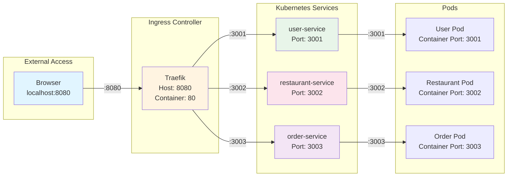

### Test All Endpoints via Ingress

```bash
# Test User Service
curl http://localhost:8080/users

# Test Restaurant Service
curl http://localhost:8080/restaurants

# Test Order Service
curl http://localhost:8080/orders
```

**Expected Outputs:**

```bash
# /users
["Rahul","Aisha","Zoya"]

# /restaurants
["Pizza Hub","Biryani House"]

# /orders
Order Placed Successfully
```

### 📊 Test Flow Diagram

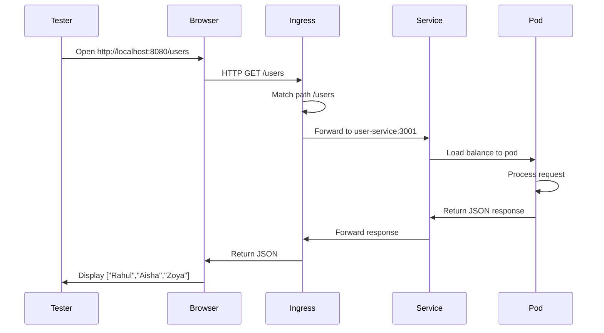

### Verify Pod Status

```bash
kubectl get pods
```

All pods should be in `Running` state.

### Verify Services

```bash
kubectl get services
```

All services should be of type `ClusterIP` and accessible within the cluster.

### Verify Ingress

```bash
kubectl get ingress
kubectl describe ingress zomato-ingress
```

Ingress should show all three paths configured.

---

## 💥 STEP 14: AUTO-HEALING DEMO (WOW MOMENT)

### 🔄 Auto-Healing Process Visualization

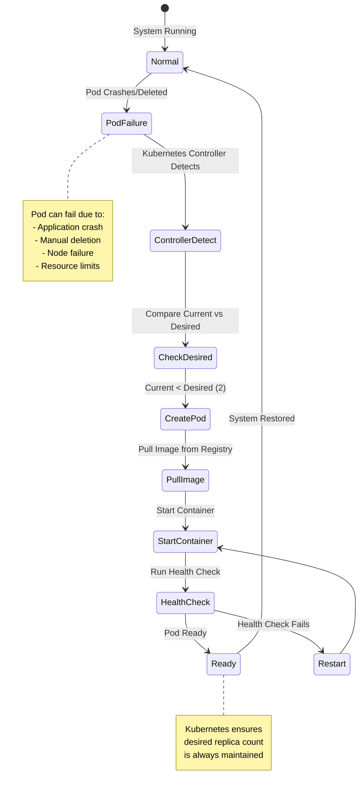

### Delete a Pod Manually

```bash
kubectl delete pod -l app=user
```

### Watch Pod Recreation

```bash
kubectl get pods -w
```

**Expected Behavior:**
- Pod gets deleted
- Kubernetes automatically creates a new pod
- New pod reaches `Running` state

### 📈 Pod Lifecycle During Auto-Healing

```mermaid
gantt
    title Pod Auto-Healing Timeline
    dateFormat X
    axisFormat %s
    
    section Pod Lifecycle
    Pod Running (Normal)     :0, 30s
    Pod Deleted              :30s, 1s
    Controller Detection     :31s, 2s
    Image Pull               :33s, 5s
    Container Start          :38s, 3s
    Health Check             :41s, 2s
    Pod Ready (Restored)     :43s, 30s
```

### Verify Replicas

```bash
kubectl get pods -l app=user
```

You should see 2 pods running (as configured with `replicas: 2`).

### 🎯 Auto-Healing Scenarios

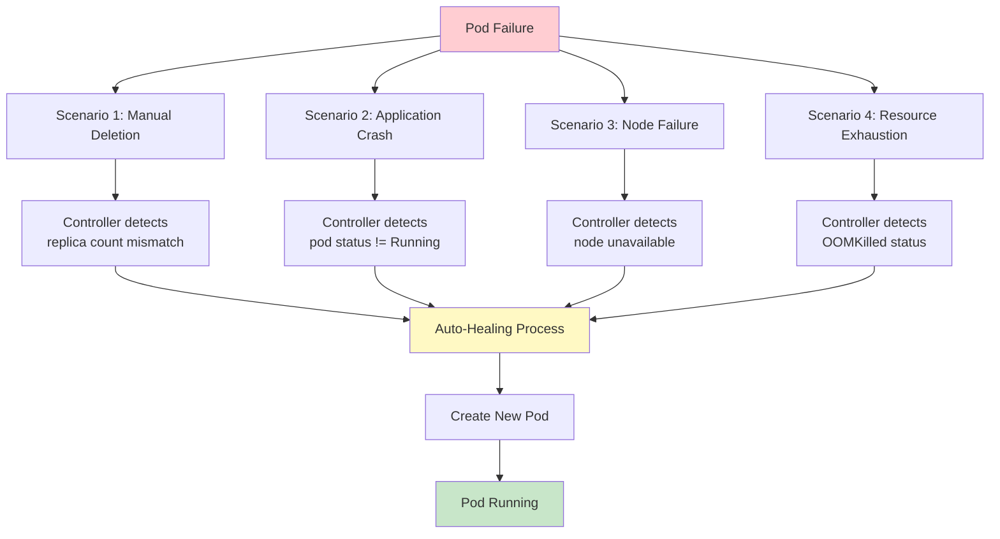

---

## 🔧 Troubleshooting

### 🔍 Troubleshooting Flow Diagram

```mermaid
flowchart TD
    Issue[Issue Detected] --> CheckType{What's the Issue?}
    
    CheckType -->|Service Not Working| CheckIngress[Check Ingress]
    CheckType -->|Pod Not Starting| CheckPod[Check Pod Status]
    CheckType -->|Image Pull Error| CheckRegistry[Check Registry]
    CheckType -->|404 Error| CheckRoutes[Check Routes]
    
    CheckIngress --> IngressStatus{kubectl get ingress}
    IngressStatus -->|Not Found| CreateIngress[Create/Apply Ingress]
    IngressStatus -->|Found| CheckTraefik[Check Traefik Pod]
    
    CheckPod --> PodStatus{kubectl get pods}
    PodStatus -->|CrashLoopBackOff| CheckLogs[Check Pod Logs]
    PodStatus -->|Pending| CheckResources[Check Resources]
    PodStatus -->|ImagePullBackOff| CheckImage[Check Image in Registry]
    
    CheckRegistry --> RegistryStatus{curl localhost:5000/v2/_catalog}
    RegistryStatus -->|Empty| PushImage[Push Image to Registry]
    RegistryStatus -->|Has Images| CheckTag[Check Image Tag]
    
    CheckRoutes --> RouteMatch{App Route = Ingress Path?}
    RouteMatch -->|No| FixRoute[Fix Application Route]
    RouteMatch -->|Yes| CheckService[Check Service]
    
    CheckLogs --> FixCode[Fix Code/Config]
    CheckResources --> ScaleDown[Reduce Replicas or Increase Resources]
    CheckImage --> TagCorrectly[Tag and Push Correctly]
    
    CreateIngress --> Test[Test Again]
    CheckTraefik --> RestartTraefik[Restart Traefik if needed]
    PushImage --> Test
    FixRoute --> Rebuild[Rebuild and Redeploy]
    FixCode --> Rebuild
    ScaleDown --> Test
    TagCorrectly --> Test
    Rebuild --> Test
    RestartTraefik --> Test
    
    Test --> Resolved{Issue Resolved?}
    Resolved -->|Yes| Success[✅ Success]
    Resolved -->|No| Issue
    
    style Issue fill:#ffcdd2
    style Success fill:#c8e6c9
    style Test fill:#fff9c4
```

### T1: Delete Image from k3d Registry

#### Find Registry Container

```bash
docker ps | grep registry
```

#### Enter Registry Container

```bash
docker exec -it k3d-zomato-registry sh
```

#### Inside Registry Container

```bash
cd /var/lib/registry/docker/registry/v2/repositories
ls
```

#### Delete Old Tag (Example: v1)

```bash
rm -rf user-service/_manifests/tags/v1
```

#### Exit Container

```bash
exit
```

#### Restart Registry

```bash
docker restart k3d-zomato-registry
```

#### Verify Deletion

```bash
curl http://localhost:5000/v2/user-service/tags/list
```

---

### T2: User Service Not Working

#### Tag Image Correctly (Both Names)

```bash
docker tag \
  k3d-zomato-registry:5000/user-service:v100 \
  localhost:5000/user-service:v100
```

#### Push Using localhost:5000

```bash
docker push localhost:5000/user-service:v100
```

#### Verify Registry Content

```bash
curl http://localhost:5000/v2/user-service/tags/list
```

#### Update Kubernetes (Internal Name)

```bash
kubectl set image deployment/user-service \
  user=k3d-zomato-registry:5000/user-service:v100
```

#### Wait for Rollout

```bash
kubectl rollout status deployment/user-service
```

#### Test

```bash
curl http://localhost:8080/users
```

> **🧠 Why This Design Exists:**
> - Host sees registry as `localhost:5000`
> - Kubernetes sees registry as `k3d-zomato-registry:5000`
> - They are two doors to the same warehouse 🚪🚪

### 🔑 Registry Naming Convention Explained

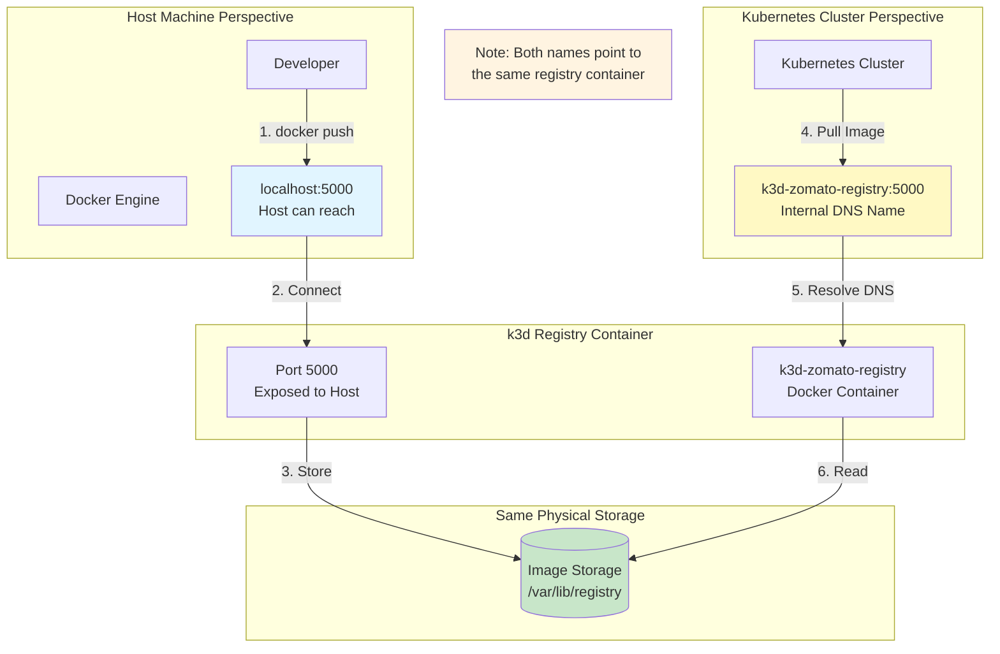

**Key Points:**
- `localhost:5000` - Used by Docker on the host machine
- `k3d-zomato-registry:5000` - Used by Kubernetes pods (internal DNS)
- Both resolve to the same Docker container
- Images stored once, accessible from both contexts

---

### T3: Restaurant Pod 404 Error

#### Root Cause

The Flask app doesn't have `/restaurants` route. Ingress forwards `/restaurants` but the app only has `/`.

#### Fix Restaurant Service

**1. Edit `restaurant-service/app.py`**

```python
from flask import Flask, jsonify
app = Flask(__name__)

@app.route('/restaurants')
def restaurants():
    return jsonify(["Pizza Hub", "Biryani House"])

@app.route('/health')
def health():
    return "OK"

app.run(host='0.0.0.0', port=3002)
```

**2. Rebuild with New Tag**

```bash
cd ~/zomato/restaurant-service

docker build --no-cache -t k3d-zomato-registry:5000/restaurant-service:v2 .
docker tag k3d-zomato-registry:5000/restaurant-service:v2 localhost:5000/restaurant-service:v2
docker push localhost:5000/restaurant-service:v2
```

**3. Update Kubernetes Deployment**

```bash
kubectl set image deployment/restaurant-service \
  restaurant=k3d-zomato-registry:5000/restaurant-service:v2
```

**4. Wait for Rollout**

```bash
kubectl rollout status deployment/restaurant-service
```

**5. Test**

```bash
curl http://localhost:8080/restaurants
```

---

### Common Issues

#### Pods Not Starting

```bash
# Check pod status
kubectl get pods

# Check pod logs
kubectl logs <pod-name>

# Describe pod for events
kubectl describe pod <pod-name>
```

#### Image Pull Errors

```bash
# Verify image exists in registry
curl http://localhost:5000/v2/_catalog

# Check if registry is accessible from cluster
kubectl run test --image=k3d-zomato-registry:5000/user-service:v1 --rm -it --restart=Never -- sh
```

#### Ingress Not Working

```bash
# Check ingress status
kubectl get ingress

# Check ingress controller
kubectl get pods -n kube-system | grep traefik

# Check ingress logs
kubectl logs -n kube-system -l app.kubernetes.io/name=traefik
```

---

## 🧹 Cleanup: FULL CLEANUP (CONTAINERS + REGISTRY + K3D CLUSTER)

### 🗑️ Cleanup Flow Diagram

```mermaid
flowchart TD
    Start([Start Cleanup]) --> Step1[1. Delete k3d Clusters<br/>k3d cluster delete --all]
    Step1 --> Step2[2. Delete k3d Registries<br/>k3d registry delete --all]
    Step2 --> Step3[3. Stop All Containers<br/>docker rm -f $ docker ps -aq]
    Step3 --> Step4[4. Remove All Images<br/>docker rmi -f $ docker images -aq]
    Step4 --> Step5[5. Remove Volumes<br/>docker volume prune -f]
    Step5 --> Step6[6. Remove Networks<br/>docker network prune -f]
    Step6 --> Step7[7. Deep Cleanup<br/>docker system prune -a -f --volumes]
    Step7 --> Verify[8. Verify Cleanup<br/>Check all resources]
    Verify --> Clean{Everything Clean?}
    Clean -->|Yes| Done([✅ Cleanup Complete])
    Clean -->|No| Step1
    
    style Start fill:#e1f5ff
    style Done fill:#c8e6c9
    style Clean fill:#fff9c4
```

### 🛑 STEP 1: Delete ALL k3d Clusters

```bash
k3d cluster delete --all
```

**Verify:**
```bash
k3d cluster list
```

➡️ Should show nothing

---

### 🧹 STEP 2: Delete ALL k3d Registries

```bash
k3d registry delete --all
```

**Verify:**
```bash
k3d registry list
```

➡️ Empty

---

### 🐳 STEP 3: Stop & Remove ALL Docker Containers

```bash
docker rm -f $(docker ps -aq)
```

If nothing exists, Docker will just return silently (that's fine).

---

### 🧼 STEP 4: Remove ALL Docker Images (⚠️ DESTRUCTIVE)

```bash
docker rmi -f $(docker images -aq)
```

This deletes:
- user-service images
- restaurant-service images
- order-service images
- k3d proxy images
- registry images

---

### 🧽 STEP 5: Remove Docker Volumes

```bash
docker volume prune -f
```

---

### 🧽 STEP 6: Remove Docker Networks Created by k3d

```bash
docker network prune -f
```

---

### 🧨 STEP 7: Deep Docker Cleanup (Final Sweep)

```bash
docker system prune -a -f --volumes
```

---

### 🔍 STEP 8: VERIFY EVERYTHING IS GONE

```bash
docker ps -a
docker images
docker volume ls
docker network ls | grep k3d
k3d cluster list
k3d registry list
```

➡️ All should be empty / clean

---

## 📊 Architecture Overview

The architecture diagrams above provide a comprehensive view of the system. Here's a quick summary:

### Key Components:

1. **Client Layer**: Browser accessing `localhost:8080`
2. **Ingress Layer**: Traefik routes requests based on paths
3. **Service Layer**: Kubernetes Services provide load balancing
4. **Pod Layer**: Multiple replicas for high availability
5. **Infrastructure**: k3d cluster with local registry

### Architecture Highlights:

- **High Availability**: Each service has 2 replicas
- **Load Balancing**: Kubernetes Services distribute traffic
- **Service Discovery**: Services communicate via DNS names
- **Auto-Healing**: Kubernetes automatically replaces failed pods
- **Isolated Network**: All services run in k3d Docker network

---

## ✅ Final Checklist

- [ ] RHEL 9 compatible
- [ ] Docker installed and working
- [ ] kubectl installed
- [ ] k3d installed
- [ ] Local registry created
- [ ] Kubernetes cluster running
- [ ] Ingress controller installed
- [ ] All 3 services built and tested locally
- [ ] All images pushed to registry
- [ ] Kubernetes deployments created
- [ ] Services exposed
- [ ] Ingress configured
- [ ] All endpoints accessible via browser
- [ ] Auto-healing verified

---

## 🎓 Key Takeaways

### 📚 Core Concepts

1. **Registry Naming**: Push from host using `localhost:5000`, pull inside Kubernetes using `k3d-zomato-registry:5000`
2. **Path Matching**: Ensure application routes match Ingress paths
3. **Replicas**: Multiple replicas provide load balancing and high availability
4. **Auto-Healing**: Kubernetes automatically recreates deleted pods
5. **Service Discovery**: Services can communicate using service names as DNS

### 🎯 Architecture Summary

```mermaid
mindmap
  root((Zomato<br/>Microservices))
    Infrastructure
      Docker
        Container Runtime
        Image Building
      k3d
        Lightweight K8s
        Local Development
      Registry
        Image Storage
        Local Registry
    Services
      User Service
        Node.js
        Port 3001
        2 Replicas
      Restaurant Service
        Python Flask
        Port 3002
        2 Replicas
      Order Service
        Go
        Port 3003
        2 Replicas
    Kubernetes
      Deployments
        Pod Management
        Replica Control
      Services
        Load Balancing
        Service Discovery
      Ingress
        External Access
        Path Routing
    Features
      Auto-Healing
      Load Balancing
      High Availability
      Service Discovery
```

### 🔑 Important Ports

| Component | Port | Purpose |
|-----------|------|---------|
| Traefik Ingress | 8080 | External access point |
| User Service | 3001 | User microservice |
| Restaurant Service | 3002 | Restaurant microservice |
| Order Service | 3003 | Order microservice |
| k3d Registry | 5000 | Docker registry |

### 🏗️ Technology Stack

```mermaid
graph TB
    subgraph "Application Layer"
        NodeJS[Node.js 18<br/>Express]
        Python[Python 3.11<br/>Flask]
        Go[Go 1.21<br/>net/http]
    end
    
    subgraph "Container Layer"
        Docker[Docker<br/>Containerization]
    end
    
    subgraph "Orchestration Layer"
        K8s[Kubernetes<br/>k3d]
        K8sDeploy[Deployments]
        K8sSvc[Services]
        K8sIngress[Ingress]
    end
    
    subgraph "Infrastructure Layer"
        Registry[Docker Registry<br/>k3d Registry]
        Network[Docker Network<br/>k3d Network]
    end
    
    NodeJS --> Docker
    Python --> Docker
    Go --> Docker
    Docker --> Registry
    Registry --> K8s
    K8s --> K8sDeploy
    K8s --> K8sSvc
    K8s --> K8sIngress
    K8s --> Network
    
    style NodeJS fill:#e8f5e9
    style Python fill:#fce4ec
    style Go fill:#f3e5f5
    style Docker fill:#e1f5ff
    style K8s fill:#fff9c4
```

---

## 📚 Next Steps

- ⏱️ 4-hour workshop flow
- 🧠 Student troubleshooting scenarios
- 📊 Architecture slides
- 🔥 CI/CD with Jenkins
- ❌ Intentional failure labs

---

## 📝 Notes

- This setup is validated on **RHEL 9**
- SELinux is set to Permissive for demo purposes
- In production, configure SELinux properly
- All services use different ports internally (3001, 3002, 3003)
- Ingress routes external traffic (port 8080) to appropriate services
- Registry cleanup requires manual intervention inside registry container

---

## 🆘 Support

If you encounter issues:

1. Check the [Troubleshooting](#troubleshooting) section
2. Verify all prerequisites are met
3. Ensure all steps are followed in order
4. Check pod logs: `kubectl logs <pod-name>`
5. Check service status: `kubectl get all`

---

## 📄 License

This guide is provided as-is for educational purposes.

---

**🎉 Happy Learning! 🚀**

